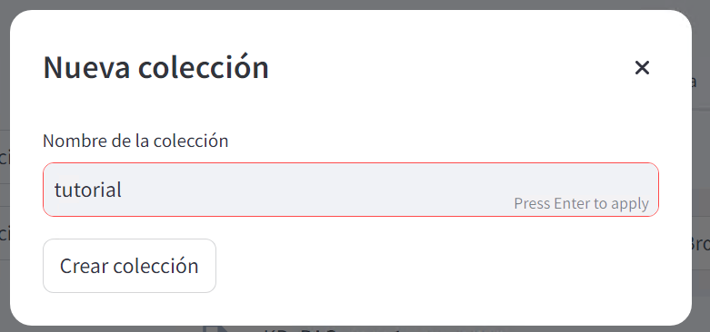
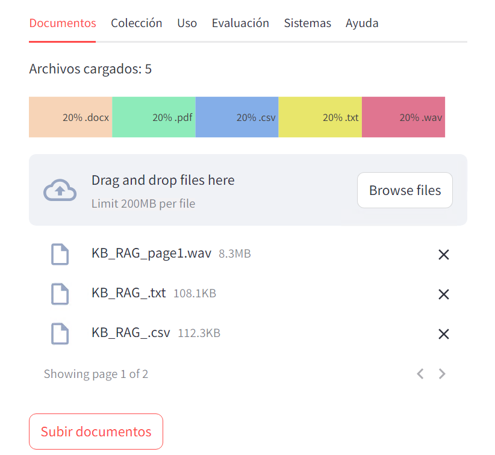
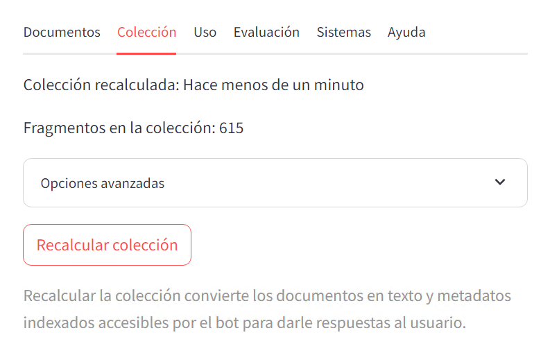
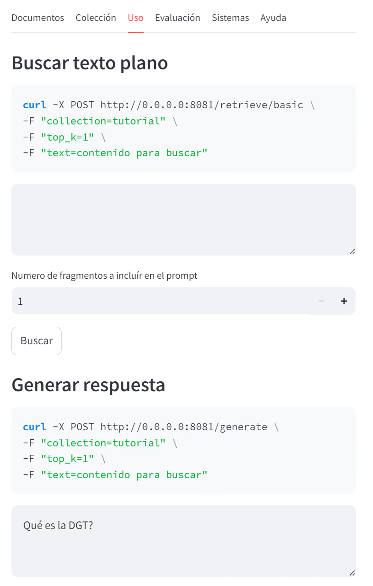

# Bienvenido al creador de Bots de Preguntas y Respuestas!

Aquí encontrarás las instrucciones de uso para crear y utilizar tu bot de Preguntas y Respuestas de manera sencilla.

## Índice
* [A. Pasos para crear tu Bot](#pasos_crear_bot)
* [B. Cómo usar tu Bot](#uso_bot)
* [C. Otras funcionalidades](#otros)
* [D. Tipos de archivos permitidos](#tipos_archivo)

## A. Pasos para crear tu Bot

 

 (Haz clic para expandir) 

  
	
1. **Crea una colección de documentos** vacía.
	1. En el menú de la izquierda, haz clic en "Nueva colección".
 	2. Introduce los datos requeridos.

2. **Sube tus documentos**. [Consulta los tipos de archivo válidos aquí](#tipos_archivo)
	1. Selecciona la colección que creaste en el menú de la izquierda
 	2. Ve a la pestaña **Colección**
	3. Arrastra y suelta tus archivos en el área designada.
	3. Haz click en "Subir documentos".
	4. **Tip:** Verifica que el número de archivos cargados en la parte superior de la página se ha actualizado.

3. **Actualiza tu colección para incluir los nuevos documentos**.
	1. Selecciona tu colección en el menú de la izquierda
 	2. Ve a la pestaña "Colección"
	3. Haz clic en el botón "Recalcular colección".
 	4. **Tip:** Verás que en la parte superior de la página aparece que la colección acaba de recalcularse

¡Listo! Tu colección está lista para [usarse](#uso_bot).

## B. Cómo usar tu Bot

 

 (Haz clic para expandir)

  
	
1. **Asegúrate de tener seleccionada la colección adecuada.**
   - Verifica que la casilla junto a tu colección esté marcada.

2. **Busca información o haz preguntas en la pestaña "Uso".**
   - Ve a la pestaña **Uso**.
   - Aquí puedes buscar fragmentos de texto relevantes o hacer preguntas que el bot responderá basándose en los documentos de tu colección. También tienes el comando para hacer lo mismo desde tu terminal.

## C. Otras funcionalidades

(Haz clic para expandir)

  

Tienes a tu disposición otras funcionalidades muy útiles:

1. **Edición de documentos dentro de una colección.**
   - Puedes añadir, eliminar o actualizar documentos en cualquier momento.
   - Recuerda siempre actualizar la colección después de hacer cambios.

2. **Configuraciones avanzadas.**
   - Accede a la pestaña **Configuración** para personalizar el comportamiento del bot según tus necesidades específicas.

3. **Evalúa tu Bot**
   - En la pestaña **Evaluación** puedes estimar la calidad de tu bot. Para ello necesitas subir tú un conjunto de preguntas y respuestas correctas. Estas se compararán con las respuestas automáticas de tu bot para determinar la calidad, así que es muy importante que las respuestas sean válidas.
   - Estamos trabajando para que en el futuro no tengas que crear tú la serie de preguntas y respuestas correctas.

4. **Comprueba que todos los servicios están activos**
   - Vete a la pestaña **Sistemas**. Los servicios que estén en verde están activos

## D. Tipos de archivo permitidos

 (Haz clic para expandir)

  

Tipos de archivo que puedes subir en la pestaña **Colección**:
* Word (.docx)
* Archivos de texto (.txt)
* PDF (.pdf)
* CSV (.csv)
* Audio (.wav)

**Tip:** Asegúrate de que tus archivos estén en uno de estos formatos antes de subirlos para evitar errores.

